# Matrix — Technical Specification

**Project:** Competency Matrix Web Application
**Division:** Dynamic Infrastructure Portal Support, Sber
**Scale:** 5 departments, 10–50 users
**Version:** 1.0
**Date:** 2026-03-24

---

## Table of Contents

1. [System Architecture](#1-system-architecture)
2. [Database Schema](#2-database-schema)
3. [API Design](#3-api-design)
4. [Frontend Architecture](#4-frontend-architecture)
5. [Authentication & Authorization](#5-authentication--authorization)
6. [Notifications](#6-notifications)
7. [Deployment Architecture](#7-deployment-architecture)
8. [Security Considerations](#8-security-considerations)
9. [Performance Considerations](#9-performance-considerations)
10. [Monitoring & Logging](#10-monitoring--logging)

---

## 1. System Architecture

### 1.1 High-Level Architecture Diagram

```
                          ┌──────────────────────────────────┐
                          │         Reverse Proxy             │
                          │        (nginx / caddy)            │
                          │   :80 / :443 (TLS termination)    │
                          └──────┬──────────────┬─────────────┘
                                 │              │
                    /api/*       │              │  /*
                                 │              │
                    ┌────────────▼──┐    ┌──────▼──────────────┐
                    │   Backend     │    │   Frontend          │
                    │   FastAPI     │    │   React SPA         │
                    │   :8000       │    │   (static, :3000    │
                    │               │    │    or served by      │
                    │  Python 3.12+ │    │    reverse proxy)    │
                    └──┬─────┬──┬──┘    └─────────────────────┘
                       │     │  │
            ┌──────────┘     │  └──────────┐
            │                │             │
   ┌────────▼─────┐  ┌──────▼──────┐  ┌───▼──────────────┐
   │ PostgreSQL 16 │  │   Redis     │  │  Telegram Bot API │
   │   :5432       │  │   :6379     │  │  (external)       │
   │               │  │             │  │                   │
   │  persistence  │  │  cache /    │  │  notifications    │
   │               │  │  sessions   │  │                   │
   └───────────────┘  └─────────────┘  └───────────────────┘
```

### 1.2 Component Overview

| Component | Technology | Purpose |
|-----------|-----------|---------|
| Backend | Python 3.12+, FastAPI, SQLAlchemy 2.0 (async), Alembic, Pydantic v2 | REST API, business logic, data access |
| Frontend | React 18+, TypeScript, Vite, TanStack Query, Recharts | SPA, data visualization, user interface |
| Database | PostgreSQL 16 | Primary persistent storage |
| Cache | Redis | Session store, aggregated score cache, rate limiting |
| Auth | JWT (access + refresh), bcrypt | Authentication and authorization |
| Notifications | Telegram Bot API | Push notifications to users |
| Reverse Proxy | nginx or Caddy | TLS termination, static file serving, routing |
| CI/CD | GitHub Actions | Automated testing, linting, deployment |
| Package Mgmt | uv (Python), pnpm (JS) | Dependency management |
| Linting | ruff (Python), ESLint + Prettier (JS) | Code quality |

### 1.3 Data Flow

```
User (Browser)
    │
    ├── GET /* ──────────────────────► Reverse Proxy ──► Static React SPA
    │
    └── POST/GET /api/v1/* ──────────► Reverse Proxy ──► FastAPI Backend
                                                              │
                                          ┌───────────────────┼───────────────┐
                                          │                   │               │
                                          ▼                   ▼               ▼
                                     PostgreSQL            Redis         Telegram API
                                    (read/write)          (cache)       (notify)
```

---

## 2. Database Schema

### 2.1 Tables

#### 2.1.1 Core Tables

**`departments`**

| Column | Type | Constraints | Description |
|--------|------|-------------|-------------|
| id | UUID | PK, DEFAULT gen_random_uuid() | Unique identifier |
| name | VARCHAR(255) | NOT NULL, UNIQUE | Department name |
| description | TEXT | | Optional description |
| sort_order | INTEGER | NOT NULL, DEFAULT 0 | Display ordering |
| created_at | TIMESTAMPTZ | NOT NULL, DEFAULT now() | Creation timestamp |
| updated_at | TIMESTAMPTZ | NOT NULL, DEFAULT now() | Last update timestamp |

**`teams`**

| Column | Type | Constraints | Description |
|--------|------|-------------|-------------|
| id | UUID | PK | Unique identifier |
| department_id | UUID | FK → departments(id) ON DELETE CASCADE, NOT NULL | Parent department |
| name | VARCHAR(255) | NOT NULL | Team name |
| description | TEXT | | Optional description |
| created_at | TIMESTAMPTZ | NOT NULL, DEFAULT now() | Creation timestamp |
| updated_at | TIMESTAMPTZ | NOT NULL, DEFAULT now() | Last update timestamp |

**Unique constraint:** `(department_id, name)`

**`users`**

| Column | Type | Constraints | Description |
|--------|------|-------------|-------------|
| id | UUID | PK | Unique identifier |
| email | VARCHAR(255) | NOT NULL, UNIQUE | Login email |
| password_hash | VARCHAR(255) | NOT NULL | bcrypt hash |
| first_name | VARCHAR(100) | NOT NULL | First name |
| last_name | VARCHAR(100) | NOT NULL | Last name |
| patronymic | VARCHAR(100) | | Patronymic (optional) |
| position | VARCHAR(255) | | Job title / position |
| department_id | UUID | FK → departments(id) ON DELETE SET NULL | Department |
| team_id | UUID | FK → teams(id) ON DELETE SET NULL | Team |
| telegram_username | VARCHAR(100) | | Telegram handle for notifications |
| notification_preferences | JSONB | NOT NULL, DEFAULT '{}' | Per-category on/off for telegram/email |
| role | user_role_enum | NOT NULL, DEFAULT 'employee' | RBAC role |
| is_active | BOOLEAN | NOT NULL, DEFAULT true | Soft-delete flag |
| created_at | TIMESTAMPTZ | NOT NULL, DEFAULT now() | Creation timestamp |
| updated_at | TIMESTAMPTZ | NOT NULL, DEFAULT now() | Last update timestamp |

**Enum `user_role_enum`:** `admin`, `head`, `department_head`, `team_lead`, `hr`, `employee`

#### 2.1.2 Competency Tables

**`competency_categories`**

| Column | Type | Constraints | Description |
|--------|------|-------------|-------------|
| id | UUID | PK | Unique identifier |
| name | competency_category_enum | NOT NULL, UNIQUE | Category type |
| description | TEXT | | Category description |

**Enum `competency_category_enum`:** `hard_skill`, `soft_skill`, `process`, `domain`

**`competencies`**

| Column | Type | Constraints | Description |
|--------|------|-------------|-------------|
| id | UUID | PK | Unique identifier |
| category_id | UUID | FK → competency_categories(id) ON DELETE RESTRICT, NOT NULL | Parent category |
| name | VARCHAR(255) | NOT NULL | Competency name |
| description | TEXT | | Detailed description |
| is_common | BOOLEAN | NOT NULL, DEFAULT false | True = applies to all departments |
| created_at | TIMESTAMPTZ | NOT NULL, DEFAULT now() | Creation timestamp |
| updated_at | TIMESTAMPTZ | NOT NULL, DEFAULT now() | Last update timestamp |

**Unique constraint:** `(category_id, name)`

**`competency_departments`** (many-to-many)

| Column | Type | Constraints | Description |
|--------|------|-------------|-------------|
| competency_id | UUID | FK → competencies(id) ON DELETE CASCADE, NOT NULL | Competency |
| department_id | UUID | FK → departments(id) ON DELETE CASCADE, NOT NULL | Department |

**Primary key:** `(competency_id, department_id)`

Only populated when `competencies.is_common = false`. If `is_common = true`, the competency applies to all departments regardless of entries in this table.

**`proficiency_levels`**

| Column | Type | Constraints | Description |
|--------|------|-------------|-------------|
| id | UUID | PK | Unique identifier |
| level | INTEGER | NOT NULL, UNIQUE, CHECK (level >= 0 AND level <= 4) | Numeric level |
| name | VARCHAR(100) | NOT NULL | Level name |
| description | TEXT | | Level description |

Seed data:

| level | name | description |
|-------|------|-------------|
| 0 | None | No knowledge or experience |
| 1 | Beginner | Basic theoretical knowledge |
| 2 | Intermediate | Can perform with guidance |
| 3 | Advanced | Can perform independently |
| 4 | Expert | Can teach and improve processes |

**`competency_level_criteria`**

| Column | Type | Constraints | Description |
|--------|------|-------------|-------------|
| id | UUID | PK | Unique identifier |
| competency_id | UUID | FK → competencies(id) ON DELETE CASCADE, NOT NULL | Competency |
| level | INTEGER | NOT NULL, CHECK (level >= 0 AND level <= 4) | Proficiency level |
| criteria_description | TEXT | NOT NULL | What this level means for this competency |

**Unique constraint:** `(competency_id, level)`

#### 2.1.3 Target Profiles

**`target_profiles`**

| Column | Type | Constraints | Description |
|--------|------|-------------|-------------|
| id | UUID | PK | Unique identifier |
| name | VARCHAR(255) | NOT NULL | Profile name |
| department_id | UUID | FK → departments(id) ON DELETE CASCADE, NOT NULL | Department |
| position | VARCHAR(255) | | Position this profile applies to |
| description | TEXT | | Profile description |
| created_at | TIMESTAMPTZ | NOT NULL, DEFAULT now() | Creation timestamp |
| updated_at | TIMESTAMPTZ | NOT NULL, DEFAULT now() | Last update timestamp |

**`target_profile_competencies`**

| Column | Type | Constraints | Description |
|--------|------|-------------|-------------|
| id | UUID | PK | Unique identifier |
| target_profile_id | UUID | FK → target_profiles(id) ON DELETE CASCADE, NOT NULL | Parent profile |
| competency_id | UUID | FK → competencies(id) ON DELETE CASCADE, NOT NULL | Required competency |
| required_level | INTEGER | NOT NULL, CHECK (required_level >= 0 AND required_level <= 4) | Expected level |

**Unique constraint:** `(target_profile_id, competency_id)`

#### 2.1.4 Assessment

**`assessment_campaigns`**

| Column | Type | Constraints | Description |
|--------|------|-------------|-------------|
| id | UUID | PK | Unique identifier |
| name | VARCHAR(255) | NOT NULL | Campaign name |
| description | TEXT | | Campaign description |
| scope | campaign_scope_enum | NOT NULL, DEFAULT 'division' | Campaign scope |
| department_id | UUID | FK → departments(id) ON DELETE SET NULL, NULL | If scoped to department |
| team_id | UUID | FK → teams(id) ON DELETE SET NULL, NULL | If scoped to team |
| start_date | DATE | NOT NULL | Campaign start date |
| end_date | DATE | NOT NULL | Campaign end date |
| status | campaign_status_enum | NOT NULL, DEFAULT 'draft' | Current status |
| created_by | UUID | FK → users(id) ON DELETE SET NULL | Creator |
| created_at | TIMESTAMPTZ | NOT NULL, DEFAULT now() | Creation timestamp |
| updated_at | TIMESTAMPTZ | NOT NULL, DEFAULT now() | Last update timestamp |

**Enum `campaign_scope_enum`:** `division`, `department`, `team`

**Enum `campaign_status_enum`:** `draft`, `active`, `collecting`, `calibration`, `finalized`, `archived`

**Check constraint:** `end_date > start_date`

**`assessments`**

| Column | Type | Constraints | Description |
|--------|------|-------------|-------------|
| id | UUID | PK | Unique identifier |
| campaign_id | UUID | FK → assessment_campaigns(id) ON DELETE CASCADE, NOT NULL | Parent campaign |
| assessee_id | UUID | FK → users(id) ON DELETE CASCADE, NOT NULL | Person being assessed |
| assessor_id | UUID | FK → users(id) ON DELETE CASCADE, NOT NULL | Person assessing |
| assessor_type | assessor_type_enum | NOT NULL | Role of assessor |
| status | assessment_status_enum | NOT NULL, DEFAULT 'pending' | Current status |
| created_at | TIMESTAMPTZ | NOT NULL, DEFAULT now() | Creation timestamp |
| completed_at | TIMESTAMPTZ | | Completion timestamp |

**Enum `assessor_type_enum`:** `self`, `peer`, `team_lead`, `head`

**Enum `assessment_status_enum`:** `pending`, `in_progress`, `completed`

**Unique constraint:** `(campaign_id, assessee_id, assessor_id)`

**`assessment_scores`**

| Column | Type | Constraints | Description |
|--------|------|-------------|-------------|
| id | UUID | PK | Unique identifier |
| assessment_id | UUID | FK → assessments(id) ON DELETE CASCADE, NOT NULL | Parent assessment |
| competency_id | UUID | FK → competencies(id) ON DELETE CASCADE, NOT NULL | Scored competency |
| score | INTEGER | NOT NULL, CHECK (score >= 0 AND score <= 4) | Numeric score |
| comment | TEXT | | Optional comment |

**Unique constraint:** `(assessment_id, competency_id)`

**`aggregated_scores`**

| Column | Type | Constraints | Description |
|--------|------|-------------|-------------|
| id | UUID | PK | Unique identifier |
| campaign_id | UUID | FK → assessment_campaigns(id) ON DELETE CASCADE, NOT NULL | Campaign |
| user_id | UUID | FK → users(id) ON DELETE CASCADE, NOT NULL | Assessed user |
| competency_id | UUID | FK → competencies(id) ON DELETE CASCADE, NOT NULL | Competency |
| self_score | NUMERIC(3,2) | | Self-assessment score |
| peer_avg | NUMERIC(3,2) | | Average peer score |
| tl_score | NUMERIC(3,2) | | Team lead score |
| head_score | NUMERIC(3,2) | | Department head score |
| final_score | NUMERIC(3,2) | | Weighted final score |
| created_at | TIMESTAMPTZ | NOT NULL, DEFAULT now() | Aggregation timestamp |

**Unique constraint:** `(campaign_id, user_id, competency_id)`

**`assessment_weights`**

| Column | Type | Constraints | Description |
|--------|------|-------------|-------------|
| id | UUID | PK | Unique identifier |
| campaign_id | UUID | FK → assessment_campaigns(id) ON DELETE CASCADE, NOT NULL, UNIQUE | Campaign |
| head_weight | DECIMAL(3,2) | NOT NULL, DEFAULT 0.35 | Department head weight |
| tl_weight | DECIMAL(3,2) | NOT NULL, DEFAULT 0.30 | Team lead weight |
| self_weight | DECIMAL(3,2) | NOT NULL, DEFAULT 0.20 | Self-assessment weight |
| peer_weight | DECIMAL(3,2) | NOT NULL, DEFAULT 0.15 | Peer average weight |

**Check constraint:** `head_weight + tl_weight + self_weight + peer_weight = 1.00`

**`calibration_flags`**

| Column | Type | Constraints | Description |
|--------|------|-------------|-------------|
| id | UUID | PK | Unique identifier |
| campaign_id | UUID | FK → assessment_campaigns(id) ON DELETE CASCADE, NOT NULL | Campaign |
| user_id | UUID | FK → users(id) ON DELETE CASCADE, NOT NULL | Assessed user |
| competency_id | UUID | FK → competencies(id) ON DELETE CASCADE, NOT NULL | Flagged competency |
| max_score | INTEGER | NOT NULL | Highest score across assessors |
| min_score | INTEGER | NOT NULL | Lowest score across assessors |
| spread | INTEGER | NOT NULL | max_score - min_score |
| resolved | BOOLEAN | NOT NULL, DEFAULT false | Whether flag has been resolved |
| resolved_by | UUID | FK → users(id) ON DELETE SET NULL, NULL | User who resolved the flag |
| resolution_notes | TEXT | | Notes on resolution |
| created_at | TIMESTAMPTZ | NOT NULL, DEFAULT now() | Flag creation timestamp |
| resolved_at | TIMESTAMPTZ | | Resolution timestamp |

A calibration flag is auto-created when `max_score - min_score >= 2` for any competency during a campaign.

#### 2.1.5 Development Plans

**`development_plans`**

| Column | Type | Constraints | Description |
|--------|------|-------------|-------------|
| id | UUID | PK | Unique identifier |
| user_id | UUID | FK → users(id) ON DELETE CASCADE, NOT NULL | Plan owner |
| campaign_id | UUID | FK → assessment_campaigns(id) ON DELETE SET NULL | Related campaign |
| created_by | UUID | FK → users(id) ON DELETE SET NULL, NOT NULL | Plan creator |
| status | plan_status_enum | NOT NULL, DEFAULT 'draft' | Plan status |
| created_at | TIMESTAMPTZ | NOT NULL, DEFAULT now() | Creation timestamp |
| updated_at | TIMESTAMPTZ | NOT NULL, DEFAULT now() | Last update timestamp |

**Enum `plan_status_enum`:** `draft`, `active`, `completed`

**`development_goals`**

| Column | Type | Constraints | Description |
|--------|------|-------------|-------------|
| id | UUID | PK | Unique identifier |
| plan_id | UUID | FK → development_plans(id) ON DELETE CASCADE, NOT NULL | Parent plan |
| competency_id | UUID | FK → competencies(id) ON DELETE CASCADE, NOT NULL | Target competency |
| current_level | INTEGER | NOT NULL, CHECK (current_level >= 0 AND current_level <= 4) | Level at plan creation |
| target_level | INTEGER | NOT NULL, CHECK (target_level >= 0 AND target_level <= 4) | Desired level |
| status | goal_status_enum | NOT NULL, DEFAULT 'planned' | Goal status |
| is_mandatory | BOOLEAN | NOT NULL, DEFAULT false | Mandatory goal (must be met by cycle end) |
| carried_over_from | UUID | FK → development_goals(id) ON DELETE SET NULL, NULL | Reference to previous cycle's goal if carried over |
| trigger_flag | BOOLEAN | NOT NULL, DEFAULT false | Flagged if mandatory goal not met at cycle end |
| deadline | DATE | | Target completion date |
| notes | TEXT | | Additional notes |

**Enum `goal_status_enum`:** `planned`, `in_progress`, `completed`

**Check constraint:** `target_level > current_level`

**`learning_resources`**

| Column | Type | Constraints | Description |
|--------|------|-------------|-------------|
| id | UUID | PK | Unique identifier |
| competency_id | UUID | FK → competencies(id) ON DELETE CASCADE, NOT NULL | Related competency |
| title | VARCHAR(500) | NOT NULL | Resource title |
| url | VARCHAR(2048) | | Link to resource |
| type | resource_type_enum | NOT NULL | Resource type |
| description | TEXT | | Resource description |

**Enum `resource_type_enum`:** `course`, `article`, `video`, `book`, `practice`

**`goal_resources`** (many-to-many)

| Column | Type | Constraints | Description |
|--------|------|-------------|-------------|
| goal_id | UUID | FK → development_goals(id) ON DELETE CASCADE, NOT NULL | Goal |
| resource_id | UUID | FK → learning_resources(id) ON DELETE CASCADE, NOT NULL | Resource |

**Primary key:** `(goal_id, resource_id)`

#### 2.1.6 Proposals

**`competency_proposals`**

| Column | Type | Constraints | Description |
|--------|------|-------------|-------------|
| id | UUID | PK | Unique identifier |
| proposed_by | UUID | FK → users(id) ON DELETE CASCADE, NOT NULL | Proposer |
| competency_name | VARCHAR(255) | NOT NULL | Proposed competency name |
| category_id | UUID | FK → competency_categories(id) ON DELETE RESTRICT, NOT NULL | Target category |
| description | TEXT | | Competency description |
| justification | TEXT | | Reason for proposing |
| status | proposal_status_enum | NOT NULL, DEFAULT 'pending' | Review status |
| reviewed_by | UUID | FK → users(id) ON DELETE SET NULL, NULL | Reviewer |
| review_notes | TEXT | | Reviewer notes |
| created_at | TIMESTAMPTZ | NOT NULL, DEFAULT now() | Creation timestamp |
| reviewed_at | TIMESTAMPTZ | | Review timestamp |

**Enum `proposal_status_enum`:** `pending`, `approved`, `rejected`

**`resource_proposals`**

| Column | Type | Constraints | Description |
|--------|------|-------------|-------------|
| id | UUID | PK | Unique identifier |
| proposed_by | UUID | FK → users(id) ON DELETE CASCADE, NOT NULL | Proposer |
| competency_id | UUID | FK → competencies(id) ON DELETE CASCADE, NOT NULL | Related competency |
| title | VARCHAR(500) | NOT NULL | Resource title |
| url | VARCHAR(2048) | | Link to resource |
| type | resource_type_enum | NOT NULL | Resource type |
| description | TEXT | | Resource description |
| action | resource_action_enum | NOT NULL | Proposed action |
| target_resource_id | UUID | FK → learning_resources(id) ON DELETE SET NULL, NULL | Existing resource (for remove action) |
| status | proposal_status_enum | NOT NULL, DEFAULT 'pending' | Review status |
| reviewed_by | UUID | FK → users(id) ON DELETE SET NULL, NULL | Reviewer |
| created_at | TIMESTAMPTZ | NOT NULL, DEFAULT now() | Creation timestamp |
| reviewed_at | TIMESTAMPTZ | | Review timestamp |

**Enum `resource_action_enum`:** `add`, `remove`

#### 2.1.7 Career Paths

**`career_paths`**

| Column | Type | Constraints | Description |
|--------|------|-------------|-------------|
| id | UUID | PK | Unique identifier |
| from_department_id | UUID | FK → departments(id) ON DELETE CASCADE, NOT NULL | Source department |
| to_department_id | UUID | FK → departments(id) ON DELETE CASCADE, NOT NULL | Target department |
| name | VARCHAR(255) | NOT NULL | Path name |
| description | TEXT | | Path description |

**`career_path_requirements`**

| Column | Type | Constraints | Description |
|--------|------|-------------|-------------|
| id | UUID | PK | Unique identifier |
| career_path_id | UUID | FK → career_paths(id) ON DELETE CASCADE, NOT NULL | Parent path |
| competency_id | UUID | FK → competencies(id) ON DELETE CASCADE, NOT NULL | Required competency |
| required_level | INTEGER | NOT NULL, CHECK (required_level >= 0 AND required_level <= 4) | Minimum level |
| is_mandatory | BOOLEAN | NOT NULL, DEFAULT false | True = mandatory requirement, false = desirable |

**Unique constraint:** `(career_path_id, competency_id)`

**Transition readiness threshold:** 90% overall (100% of mandatory requirements + 90% overall score). Transition requires: competency threshold met + manager_approval + hr_approval + vacancy available + minimum tenure in current role.

#### 2.1.8 Assessment Staleness Rule

Assessments older than 2 years are marked "stale" in the UI. Query for stale assessments:

```sql
WHERE last_assessed_at < NOW() - INTERVAL '2 years'
```

Stale assessments remain visible for historical reference but are visually distinguished and excluded from active gap analysis calculations.

#### 2.1.9 Audit

**`audit_log`**

| Column | Type | Constraints | Description |
|--------|------|-------------|-------------|
| id | UUID | PK | Unique identifier |
| user_id | UUID | FK → users(id) ON DELETE SET NULL | Actor |
| action | VARCHAR(50) | NOT NULL | Action performed (create, update, delete, login, etc.) |
| entity_type | VARCHAR(100) | NOT NULL | Target entity type |
| entity_id | UUID | | Target entity ID |
| details | JSONB | | Additional context |
| created_at | TIMESTAMPTZ | NOT NULL, DEFAULT now() | Action timestamp |

**Index:** `(entity_type, entity_id)`, `(user_id)`, `(created_at DESC)`

### 2.2 ER Diagram

```mermaid
erDiagram
    departments ||--o{ teams : "has"
    departments ||--o{ users : "belongs to"
    teams ||--o{ users : "member of"

    departments ||--o{ competency_departments : ""
    competencies ||--o{ competency_departments : ""

    competency_categories ||--o{ competencies : "categorizes"

    competencies ||--o{ competency_level_criteria : "defines criteria"

    departments ||--o{ target_profiles : "has"
    target_profiles ||--o{ target_profile_competencies : "requires"
    competencies ||--o{ target_profile_competencies : ""

    users ||--o{ assessments : "assessee"
    users ||--o{ assessments : "assessor"
    assessment_campaigns ||--o{ assessments : "contains"
    assessments ||--o{ assessment_scores : "has"
    competencies ||--o{ assessment_scores : ""

    assessment_campaigns ||--o{ aggregated_scores : ""
    users ||--o{ aggregated_scores : ""
    competencies ||--o{ aggregated_scores : ""

    users ||--o{ development_plans : "owns"
    assessment_campaigns ||--o{ development_plans : "triggers"
    development_plans ||--o{ development_goals : "contains"
    competencies ||--o{ development_goals : ""
    development_goals ||--o{ goal_resources : ""
    learning_resources ||--o{ goal_resources : ""
    competencies ||--o{ learning_resources : ""

    departments ||--o{ career_paths : "from"
    departments ||--o{ career_paths : "to"
    career_paths ||--o{ career_path_requirements : "requires"
    competencies ||--o{ career_path_requirements : ""

    assessment_campaigns ||--o{ assessment_weights : "configures"
    assessment_campaigns ||--o{ calibration_flags : "flags"
    users ||--o{ calibration_flags : "flagged user"
    competencies ||--o{ calibration_flags : "flagged competency"

    users ||--o{ competency_proposals : "proposes"
    competency_categories ||--o{ competency_proposals : "target category"
    users ||--o{ resource_proposals : "proposes"
    competencies ||--o{ resource_proposals : "for competency"

    users ||--o{ audit_log : "performed by"

    departments {
        UUID id PK
        VARCHAR name
        TEXT description
        INTEGER sort_order
        TIMESTAMPTZ created_at
        TIMESTAMPTZ updated_at
    }

    teams {
        UUID id PK
        UUID department_id FK
        VARCHAR name
        TEXT description
        TIMESTAMPTZ created_at
        TIMESTAMPTZ updated_at
    }

    users {
        UUID id PK
        VARCHAR email
        VARCHAR password_hash
        VARCHAR first_name
        VARCHAR last_name
        VARCHAR patronymic
        VARCHAR position
        UUID department_id FK
        UUID team_id FK
        VARCHAR telegram_username
        user_role_enum role
        BOOLEAN is_active
        TIMESTAMPTZ created_at
        TIMESTAMPTZ updated_at
    }

    competency_categories {
        UUID id PK
        competency_category_enum name
        TEXT description
    }

    competencies {
        UUID id PK
        UUID category_id FK
        VARCHAR name
        TEXT description
        BOOLEAN is_common
        TIMESTAMPTZ created_at
        TIMESTAMPTZ updated_at
    }

    competency_departments {
        UUID competency_id FK
        UUID department_id FK
    }

    proficiency_levels {
        UUID id PK
        INTEGER level
        VARCHAR name
        TEXT description
    }

    competency_level_criteria {
        UUID id PK
        UUID competency_id FK
        INTEGER level
        TEXT criteria_description
    }

    target_profiles {
        UUID id PK
        VARCHAR name
        UUID department_id FK
        VARCHAR position
        TEXT description
        TIMESTAMPTZ created_at
        TIMESTAMPTZ updated_at
    }

    target_profile_competencies {
        UUID id PK
        UUID target_profile_id FK
        UUID competency_id FK
        INTEGER required_level
    }

    assessment_campaigns {
        UUID id PK
        VARCHAR name
        TEXT description
        DATE start_date
        DATE end_date
        campaign_status_enum status
        UUID created_by FK
        TIMESTAMPTZ created_at
        TIMESTAMPTZ updated_at
    }

    assessments {
        UUID id PK
        UUID campaign_id FK
        UUID assessee_id FK
        UUID assessor_id FK
        assessor_type_enum assessor_type
        assessment_status_enum status
        TIMESTAMPTZ created_at
        TIMESTAMPTZ completed_at
    }

    assessment_scores {
        UUID id PK
        UUID assessment_id FK
        UUID competency_id FK
        INTEGER score
        TEXT comment
    }

    aggregated_scores {
        UUID id PK
        UUID campaign_id FK
        UUID user_id FK
        UUID competency_id FK
        NUMERIC self_score
        NUMERIC peer_avg
        NUMERIC tl_score
        NUMERIC head_score
        NUMERIC final_score
        TIMESTAMPTZ created_at
    }

    assessment_weights {
        UUID id PK
        UUID campaign_id FK
        DECIMAL head_weight
        DECIMAL tl_weight
        DECIMAL self_weight
        DECIMAL peer_weight
    }

    calibration_flags {
        UUID id PK
        UUID campaign_id FK
        UUID user_id FK
        UUID competency_id FK
        INTEGER max_score
        INTEGER min_score
        INTEGER spread
        BOOLEAN resolved
        UUID resolved_by FK
        TEXT resolution_notes
        TIMESTAMPTZ created_at
        TIMESTAMPTZ resolved_at
    }

    development_plans {
        UUID id PK
        UUID user_id FK
        UUID campaign_id FK
        UUID created_by FK
        plan_status_enum status
        TIMESTAMPTZ created_at
        TIMESTAMPTZ updated_at
    }

    development_goals {
        UUID id PK
        UUID plan_id FK
        UUID competency_id FK
        INTEGER current_level
        INTEGER target_level
        goal_status_enum status
        DATE deadline
        TEXT notes
    }

    learning_resources {
        UUID id PK
        UUID competency_id FK
        VARCHAR title
        VARCHAR url
        resource_type_enum type
        TEXT description
    }

    goal_resources {
        UUID goal_id FK
        UUID resource_id FK
    }

    career_paths {
        UUID id PK
        UUID from_department_id FK
        UUID to_department_id FK
        VARCHAR name
        TEXT description
    }

    career_path_requirements {
        UUID id PK
        UUID career_path_id FK
        UUID competency_id FK
        INTEGER required_level
    }

    audit_log {
        UUID id PK
        UUID user_id FK
        VARCHAR action
        VARCHAR entity_type
        UUID entity_id
        JSONB details
        TIMESTAMPTZ created_at
    }
```



---

## 3. API Design

Base URL: `/api/v1`

All endpoints return JSON. All list endpoints support `?page=1&per_page=20` pagination. Error responses follow a consistent schema:

```json
{
  "detail": "Error description",
  "code": "ERROR_CODE"
}
```

### 3.1 Authentication — `/api/v1/auth`

| Method | Endpoint | Description | Auth |
|--------|----------|-------------|------|
| POST | `/auth/login` | Authenticate user | None |
| POST | `/auth/refresh` | Refresh access token | Refresh token |
| POST | `/auth/logout` | Invalidate refresh token | Access token |
| GET | `/auth/me` | Get current user profile | Access token |

**POST `/auth/login`**

Request:
```json
{
  "email": "user@example.com",
  "password": "secret"
}
```

Response `200`:
```json
{
  "access_token": "eyJ...",
  "refresh_token": "eyJ...",
  "token_type": "bearer",
  "expires_in": 900,
  "user": {
    "id": "uuid",
    "email": "user@example.com",
    "first_name": "Ivan",
    "last_name": "Petrov",
    "role": "employee"
  }
}
```

**POST `/auth/refresh`**

Request:
```json
{
  "refresh_token": "eyJ..."
}
```

Response `200`: Same as login response.

### 3.2 Users — `/api/v1/users`

| Method | Endpoint | Description | Auth |
|--------|----------|-------------|------|
| GET | `/users` | List users (filterable) | admin, department_head |
| POST | `/users` | Create user | admin |
| GET | `/users/{id}` | Get user details | Any authenticated |
| PATCH | `/users/{id}` | Update user | admin, self |
| DELETE | `/users/{id}` | Deactivate user (soft delete) | admin |

**GET `/users`** — Query parameters:

| Param | Type | Description |
|-------|------|-------------|
| department_id | UUID | Filter by department |
| team_id | UUID | Filter by team |
| role | string | Filter by role |
| is_active | bool | Filter by active status |
| search | string | Search by name/email |
| page | int | Page number (default: 1) |
| per_page | int | Items per page (default: 20, max: 100) |

Response `200`:
```json
{
  "items": [
    {
      "id": "uuid",
      "email": "user@example.com",
      "first_name": "Ivan",
      "last_name": "Petrov",
      "patronymic": "Sergeevich",
      "position": "Engineer",
      "department": { "id": "uuid", "name": "Platform" },
      "team": { "id": "uuid", "name": "SRE" },
      "role": "employee",
      "is_active": true
    }
  ],
  "total": 42,
  "page": 1,
  "per_page": 20
}
```

**POST `/users`** — Request:
```json
{
  "email": "new@example.com",
  "password": "securepassword",
  "first_name": "Ivan",
  "last_name": "Petrov",
  "patronymic": "Sergeevich",
  "position": "Engineer",
  "department_id": "uuid",
  "team_id": "uuid",
  "telegram_username": "ivan_petrov",
  "role": "employee"
}
```

### 3.3 Departments — `/api/v1/departments`

| Method | Endpoint | Description | Auth |
|--------|----------|-------------|------|
| GET | `/departments` | List all departments | Any authenticated |
| POST | `/departments` | Create department | admin |
| GET | `/departments/{id}` | Get department with teams | Any authenticated |
| PATCH | `/departments/{id}` | Update department | admin |
| DELETE | `/departments/{id}` | Delete department | admin |
| GET | `/departments/{id}/teams` | List teams in department | Any authenticated |
| POST | `/departments/{id}/teams` | Create team | admin, department_head |

### 3.4 Competencies — `/api/v1/competencies`

| Method | Endpoint | Description | Auth |
|--------|----------|-------------|------|
| GET | `/competencies` | List competencies | Any authenticated |
| POST | `/competencies` | Create competency | admin |
| GET | `/competencies/{id}` | Get competency details + criteria | Any authenticated |
| PATCH | `/competencies/{id}` | Update competency | admin |
| DELETE | `/competencies/{id}` | Delete competency | admin |
| PUT | `/competencies/{id}/criteria` | Set level criteria | admin |

**GET `/competencies`** — Query parameters:

| Param | Type | Description |
|-------|------|-------------|
| category | string | Filter by category enum |
| department_id | UUID | Filter by department (includes common) |
| is_common | bool | Filter common/department-specific |
| search | string | Search by name |

**PUT `/competencies/{id}/criteria`** — Request:
```json
{
  "criteria": [
    { "level": 0, "criteria_description": "No knowledge" },
    { "level": 1, "criteria_description": "Can describe basics" },
    { "level": 2, "criteria_description": "Applies with help" },
    { "level": 3, "criteria_description": "Works independently" },
    { "level": 4, "criteria_description": "Mentors others" }
  ]
}
```

### 3.5 Target Profiles — `/api/v1/target-profiles`

| Method | Endpoint | Description | Auth |
|--------|----------|-------------|------|
| GET | `/target-profiles` | List profiles | Any authenticated |
| POST | `/target-profiles` | Create profile | admin, department_head |
| GET | `/target-profiles/{id}` | Get profile with competencies | Any authenticated |
| PATCH | `/target-profiles/{id}` | Update profile | admin, department_head |
| DELETE | `/target-profiles/{id}` | Delete profile | admin |
| PUT | `/target-profiles/{id}/competencies` | Set required competencies | admin, department_head |
| GET | `/target-profiles/{id}/gap/{user_id}` | Gap analysis for user | Any authenticated |

### 3.6 Assessment Campaigns — `/api/v1/campaigns`

| Method | Endpoint | Description | Auth |
|--------|----------|-------------|------|
| GET | `/campaigns` | List campaigns | Any authenticated |
| POST | `/campaigns` | Create campaign | admin, department_head |
| GET | `/campaigns/{id}` | Get campaign details | Any authenticated |
| PATCH | `/campaigns/{id}` | Update campaign | admin, department_head |
| POST | `/campaigns/{id}/activate` | Activate campaign | admin, department_head |
| POST | `/campaigns/{id}/complete` | Complete campaign | admin, department_head |
| POST | `/campaigns/{id}/archive` | Archive campaign | admin |
| GET | `/campaigns/{id}/progress` | Campaign completion progress | admin, department_head |

### 3.7 Assessments — `/api/v1/assessments`

| Method | Endpoint | Description | Auth |
|--------|----------|-------------|------|
| GET | `/assessments` | List assessments (filtered by current user role) | Any authenticated |
| POST | `/assessments` | Create assessment | admin, department_head, team_lead |
| GET | `/assessments/{id}` | Get assessment with scores | Assessor, admin |
| POST | `/assessments/{id}/submit` | Submit completed assessment | Assessor |

**POST `/assessments/{id}/submit`** — Request:
```json
{
  "scores": [
    {
      "competency_id": "uuid",
      "score": 3,
      "comment": "Strong analytical skills"
    }
  ]
}
```

### 3.8 Analytics — `/api/v1/analytics`

| Method | Endpoint | Description | Auth |
|--------|----------|-------------|------|
| GET | `/analytics/radar/{user_id}` | Radar chart data for user | Self, team_lead, department_head, admin |
| GET | `/analytics/heatmap/{department_id}` | Heatmap data for department | department_head, admin |
| GET | `/analytics/history/{user_id}` | Assessment history across campaigns | Self, team_lead, department_head, admin |
| GET | `/analytics/department/{department_id}/summary` | Department summary statistics | department_head, admin |

**GET `/analytics/radar/{user_id}`** — Query parameters: `campaign_id` (optional, defaults to latest)

Response `200`:
```json
{
  "user_id": "uuid",
  "campaign_id": "uuid",
  "data": [
    {
      "competency_id": "uuid",
      "competency_name": "Kubernetes",
      "category": "hard_skill",
      "self_score": 3.0,
      "peer_avg": 2.5,
      "tl_score": 3.0,
      "head_score": null,
      "final_score": 2.8,
      "target_level": 4
    }
  ]
}
```

**GET `/analytics/heatmap/{department_id}`** — Query parameters: `campaign_id` (optional)

Response `200`:
```json
{
  "department_id": "uuid",
  "campaign_id": "uuid",
  "competencies": ["Kubernetes", "CI/CD", "Monitoring"],
  "users": [
    {
      "user_id": "uuid",
      "user_name": "Ivan Petrov",
      "scores": [2.8, 3.5, 1.2]
    }
  ]
}
```

### 3.9 Development Plans — `/api/v1/development-plans`

| Method | Endpoint | Description | Auth |
|--------|----------|-------------|------|
| GET | `/development-plans` | List plans | Self, team_lead, department_head, admin |
| POST | `/development-plans` | Create plan | team_lead, department_head, admin |
| GET | `/development-plans/{id}` | Get plan with goals | Plan owner, team_lead, admin |
| PATCH | `/development-plans/{id}` | Update plan status | Plan creator, admin |
| POST | `/development-plans/{id}/goals` | Add goal | Plan creator, admin |
| PATCH | `/development-plans/{id}/goals/{goal_id}` | Update goal | Plan owner, plan creator |
| DELETE | `/development-plans/{id}/goals/{goal_id}` | Remove goal | Plan creator, admin |
| GET | `/development-plans/{id}/goals/{goal_id}/resources` | List recommended resources | Any authenticated |

### 3.10 Career Paths — `/api/v1/career-paths`

| Method | Endpoint | Description | Auth |
|--------|----------|-------------|------|
| GET | `/career-paths` | List all career paths | Any authenticated |
| POST | `/career-paths` | Create career path | admin |
| GET | `/career-paths/{id}` | Get path with requirements | Any authenticated |
| PATCH | `/career-paths/{id}` | Update path | admin |
| DELETE | `/career-paths/{id}` | Delete path | admin |
| GET | `/career-paths/{id}/gap/{user_id}` | Gap analysis for user vs path | Self, team_lead, admin |

**GET `/career-paths/{id}/gap/{user_id}`**

Response `200`:
```json
{
  "career_path": { "id": "uuid", "name": "Platform → SRE" },
  "user_id": "uuid",
  "gaps": [
    {
      "competency_id": "uuid",
      "competency_name": "Incident Management",
      "current_level": 1,
      "required_level": 3,
      "gap": 2
    }
  ],
  "readiness_percent": 65.0
}
```

### 3.11 Import/Export — `/api/v1/import`, `/api/v1/export`

| Method | Endpoint | Description | Auth |
|--------|----------|-------------|------|
| POST | `/import/users` | Import users from CSV | admin |
| POST | `/import/competencies` | Import competencies from CSV | admin |
| GET | `/export/report` | Export assessment report (Excel/PDF) | department_head, admin |
| GET | `/export/user-report/{user_id}` | Export individual user report | Self, team_lead, admin |

**POST `/import/users`** — `multipart/form-data` with CSV file.

**GET `/export/report`** — Query parameters: `campaign_id`, `department_id`, `format` (`xlsx` | `pdf`)

### 3.12 Notifications — `/api/v1/notifications`

| Method | Endpoint | Description | Auth |
|--------|----------|-------------|------|
| POST | `/notifications/send` | Send Telegram notification | admin, system |
| POST | `/notifications/campaign-reminder` | Send reminders for active campaign | admin |
| GET | `/notifications/settings` | Get notification preferences | Self |
| PATCH | `/notifications/settings` | Update notification preferences | Self |

### 3.13 System — `/api/v1/system`

| Method | Endpoint | Description | Auth |
|--------|----------|-------------|------|
| GET | `/system/health` | Health check | None |
| GET | `/system/audit-log` | View audit log | admin |

---

## 4. Frontend Architecture

### 4.1 Project Structure

```
frontend/
├── public/
│   └── favicon.svg
├── src/
│   ├── api/                     # API client layer
│   │   ├── client.ts            # Axios instance, interceptors
│   │   ├── auth.ts              # Auth endpoints
│   │   ├── users.ts             # Users endpoints
│   │   ├── departments.ts       # Departments endpoints
│   │   ├── competencies.ts      # Competencies endpoints
│   │   ├── campaigns.ts         # Campaign endpoints
│   │   ├── assessments.ts       # Assessment endpoints
│   │   ├── analytics.ts         # Analytics endpoints
│   │   ├── development-plans.ts # IDP endpoints
│   │   ├── career-paths.ts      # Career path endpoints
│   │   └── notifications.ts     # Notification endpoints
│   ├── components/              # Reusable UI components
│   │   ├── ui/                  # Primitives (Button, Input, Modal, Table, etc.)
│   │   ├── layout/              # Layout components (Sidebar, Header, PageWrapper)
│   │   ├── charts/              # Chart components
│   │   │   ├── RadarChart.tsx   # Competency radar (Recharts)
│   │   │   ├── HeatmapChart.tsx # Department heatmap (custom)
│   │   │   └── HistoryChart.tsx # Score history over time
│   │   ├── assessment/          # Assessment-related components
│   │   ├── competency/          # Competency-related components
│   │   └── common/              # Shared components (UserAvatar, RoleBadge, etc.)
│   ├── hooks/                   # Custom React hooks
│   │   ├── useAuth.ts           # Auth context hook
│   │   ├── usePermissions.ts    # RBAC permission checks
│   │   └── useDebounce.ts       # Input debounce
│   ├── pages/                   # Route-level page components
│   │   ├── LoginPage.tsx
│   │   ├── DashboardPage.tsx
│   │   ├── UsersPage.tsx
│   │   ├── UserProfilePage.tsx
│   │   ├── DepartmentsPage.tsx
│   │   ├── CompetenciesPage.tsx
│   │   ├── TargetProfilesPage.tsx
│   │   ├── CampaignsPage.tsx
│   │   ├── CampaignDetailPage.tsx
│   │   ├── AssessmentFormPage.tsx
│   │   ├── AnalyticsPage.tsx
│   │   ├── DevelopmentPlanPage.tsx
│   │   ├── CareerPathsPage.tsx
│   │   └── AuditLogPage.tsx
│   ├── types/                   # TypeScript type definitions
│   │   ├── api.ts               # API response types
│   │   ├── models.ts            # Domain model types
│   │   └── enums.ts             # Enum definitions
│   ├── utils/                   # Utility functions
│   │   ├── formatters.ts        # Date, number formatting
│   │   ├── validators.ts        # Form validation helpers
│   │   └── export.ts            # Client-side PDF generation (jsPDF)
│   ├── context/                 # React context providers
│   │   └── AuthContext.tsx       # Auth state provider
│   ├── router.tsx               # React Router configuration
│   ├── App.tsx                  # Root component
│   └── main.tsx                 # Entry point
├── index.html
├── tsconfig.json
├── vite.config.ts
├── package.json
└── .eslintrc.cjs
```

### 4.2 Routing

```
/login                                → LoginPage
/                                     → DashboardPage (redirect if not authed)
/users                                → UsersPage
/users/:id                            → UserProfilePage
/departments                          → DepartmentsPage
/departments/:id                      → DepartmentDetailPage
/competencies                         → CompetenciesPage
/target-profiles                      → TargetProfilesPage
/target-profiles/:id                  → TargetProfileDetailPage
/campaigns                            → CampaignsPage
/campaigns/:id                        → CampaignDetailPage
/assessments/:id                      → AssessmentFormPage
/analytics                            → AnalyticsPage
/development-plans                    → DevelopmentPlanPage
/development-plans/:id                → DevelopmentPlanDetailPage
/career-paths                         → CareerPathsPage
/career-paths/:id/gap                 → CareerGapAnalysisPage
/admin/audit-log                      → AuditLogPage
```

### 4.3 State Management

| State Type | Solution | Usage |
|-----------|----------|-------|
| Server state | TanStack Query (React Query) | All API data fetching, caching, and invalidation |
| Auth state | React Context + localStorage | JWT tokens, current user, role |
| Form state | React Hook Form | Assessment forms, user forms, competency editors |
| UI state | Component-local useState | Modals, filters, sidebar collapse |

TanStack Query configuration:
- `staleTime`: 5 minutes for mostly static data (competencies, departments), 1 minute for dynamic data (assessments, campaigns)
- Automatic refetch on window focus for active campaigns
- Optimistic updates for assessment score submissions

### 4.4 Charts

**Radar Chart (Recharts):**
- Displays competency scores for a single user
- Overlays: self-assessment, peer average, team lead score, target profile
- Toggleable layers
- Responsive, supports touch

**Heatmap (Custom Component):**
- Grid: rows = users, columns = competencies
- Cell color gradient: red (0) → yellow (2) → green (4)
- Click-through to individual user radar
- Sortable columns

**History Chart (Recharts LineChart):**
- Score progression across campaigns
- Per-competency or aggregate view

### 4.5 Export

| Format | Method | Library |
|--------|--------|---------|
| PDF (individual report) | Client-side | jsPDF + html2canvas |
| Excel (department report) | Server-side | openpyxl (Python) |

---

## 5. Authentication & Authorization

### 5.1 JWT Flow

```
Client                              Server
  │                                    │
  │  POST /auth/login                  │
  │  { email, password }               │
  │ ──────────────────────────────────►│
  │                                    │  Verify bcrypt hash
  │                                    │  Generate tokens
  │  { access_token, refresh_token }   │
  │ ◄──────────────────────────────────│
  │                                    │
  │  GET /api/v1/users                 │
  │  Authorization: Bearer <access>    │
  │ ──────────────────────────────────►│
  │                                    │  Validate JWT, extract user
  │  { data }                          │
  │ ◄──────────────────────────────────│
  │                                    │
  │  POST /auth/refresh                │
  │  { refresh_token }                 │
  │ ──────────────────────────────────►│
  │                                    │  Validate refresh token
  │  { new access_token,               │  Rotate refresh token
  │    new refresh_token }             │
  │ ◄──────────────────────────────────│
```

### 5.2 Token Details

| Token | Lifetime | Storage (Client) | Contains |
|-------|----------|-------------------|----------|
| Access token | 15 minutes | Memory (variable) | user_id, email, role, exp, iat |
| Refresh token | 7 days | httpOnly cookie or localStorage | user_id, token_id, exp, iat |

- Refresh tokens are stored in Redis with a whitelist pattern. On refresh, the old token is invalidated and a new one is issued (rotation).
- On logout, the refresh token is removed from Redis.

### 5.3 Password Hashing

- Algorithm: bcrypt
- Work factor: 12 rounds
- Library: `passlib[bcrypt]` or `bcrypt`

### 5.4 RBAC — Role-Based Access Control

#### Roles

| Role | Scope | Description |
|------|-------|-------------|
| `admin` | Global | Full system access, user management, audit log |
| `department_head` | Department | Manages department competencies, profiles, campaigns, views all department data |
| `team_lead` | Team | Creates assessments for team members, views team analytics, manages IDPs |
| `employee` | Self | Self-assessment, views own scores and plans |

#### Permission Matrix

| Resource | Action | admin | department_head | team_lead | employee |
|----------|--------|-------|-----------------|-----------|----------|
| Users | List all | Yes | Own department | Own team | No |
| Users | Create | Yes | No | No | No |
| Users | Update | Yes | No | No | Self only |
| Users | Delete | Yes | No | No | No |
| Departments | Create/Update/Delete | Yes | No | No | No |
| Departments | View | Yes | Yes | Yes | Yes |
| Teams | Create/Update | Yes | Own department | No | No |
| Competencies | Create/Update/Delete | Yes | No | No | No |
| Competencies | View | Yes | Yes | Yes | Yes |
| Target Profiles | Create/Update/Delete | Yes | Own department | No | No |
| Target Profiles | View | Yes | Yes | Yes | Yes |
| Campaigns | Create | Yes | Own department | No | No |
| Campaigns | Activate/Complete | Yes | Own department | No | No |
| Campaigns | View | Yes | Yes | Yes | Own |
| Assessments | Create | Yes | Own department | Own team | No |
| Assessments | Submit | Yes | Assigned | Assigned | Assigned |
| Assessments | View scores | Yes | Own department | Own team | Self only |
| Analytics (Radar) | View | Yes | Own department | Own team | Self only |
| Analytics (Heatmap) | View | Yes | Own department | No | No |
| Development Plans | Create | Yes | Own department | Own team | No |
| Development Plans | View | Yes | Own department | Own team | Self only |
| Development Plans | Update goals | Yes | Creator | Creator | Own plan |
| Career Paths | Create/Update/Delete | Yes | No | No | No |
| Career Paths | View | Yes | Yes | Yes | Yes |
| Career Path Gap | View | Yes | Own department | Own team | Self only |
| Import | CSV | Yes | No | No | No |
| Export | Reports | Yes | Own department | No | No |
| Notifications | Send | Yes | No | No | No |
| Audit Log | View | Yes | No | No | No |

### 5.5 Backend Middleware

```
Request → CORS → Rate Limiter → JWT Validation → RBAC Check → Route Handler
```

RBAC is enforced via FastAPI dependencies:

```python
async def require_role(roles: list[str]):
    async def dependency(current_user: User = Depends(get_current_user)):
        if current_user.role not in roles:
            raise HTTPException(status_code=403, detail="Insufficient permissions")
        return current_user
    return dependency
```

Scope-based filtering (e.g., department_head sees only own department) is applied at the query level in service/repository layers.

---

## 6. Deployment Architecture

### 6.1 Local Development (Docker Compose)

```yaml
services:
  backend:
    build: ./backend
    ports: ["8000:8000"]
    env_file: .env
    volumes: ["./backend:/app"]
    depends_on: [db, redis]
    command: uvicorn app.main:app --reload --host 0.0.0.0

  frontend:
    build: ./frontend
    ports: ["3000:3000"]
    volumes: ["./frontend:/app"]
    command: pnpm dev --host

  db:
    image: postgres:16-alpine
    ports: ["5432:5432"]
    environment:
      POSTGRES_DB: matrix
      POSTGRES_USER: matrix
      POSTGRES_PASSWORD: matrix_dev
    volumes: ["pgdata:/var/lib/postgresql/data"]

  redis:
    image: redis:7-alpine
    ports: ["6379:6379"]

  telegram-bot:
    build: ./backend
    env_file: .env
    command: python -m app.telegram_bot
    depends_on: [db, redis]

volumes:
  pgdata:
```

### 6.2 Production Architecture

```
                    Internet
                       │
                       ▼
              ┌────────────────┐
              │  Reverse Proxy │
              │  (nginx/caddy) │
              │  :80 / :443    │
              └───┬────────┬───┘
                  │        │
         /api/*   │        │  /*
                  │        │
          ┌───────▼──┐  ┌──▼──────────┐
          │ Backend   │  │  Frontend    │
          │ (FastAPI) │  │  (static     │
          │ x2 replicas│ │   files)     │
          └──┬────┬───┘  └─────────────┘
             │    │
    ┌────────┘    └────────┐
    ▼                      ▼
┌──────────┐        ┌──────────┐
│PostgreSQL│        │  Redis   │
│  :5432   │        │  :6379   │
└──────────┘        └──────────┘
```

### 6.3 Environment Variables

| Variable | Description | Example |
|----------|-------------|---------|
| `DATABASE_URL` | PostgreSQL connection string | `postgresql+asyncpg://user:pass@db:5432/matrix` |
| `REDIS_URL` | Redis connection string | `redis://redis:6379/0` |
| `JWT_SECRET_KEY` | Secret for JWT signing | (random 64-char string) |
| `JWT_ALGORITHM` | JWT algorithm | `HS256` |
| `ACCESS_TOKEN_EXPIRE_MINUTES` | Access token TTL | `15` |
| `REFRESH_TOKEN_EXPIRE_DAYS` | Refresh token TTL | `7` |
| `TELEGRAM_BOT_TOKEN` | Telegram Bot API token | `123456:ABC-DEF...` |
| `CORS_ORIGINS` | Allowed origins | `["https://matrix.example.com"]` |
| `ENVIRONMENT` | Runtime environment | `development` / `production` |
| `LOG_LEVEL` | Logging level | `INFO` |
| `BCRYPT_ROUNDS` | bcrypt work factor | `12` |

### 6.4 Database Migrations

Alembic manages schema migrations:

```
alembic upgrade head          # Apply all migrations
alembic revision --autogenerate -m "description"  # Generate migration
alembic downgrade -1          # Rollback one migration
```

Migration files are stored in `backend/alembic/versions/` and committed to version control.

---

## 7. Security Considerations

### 7.1 Transport Security

- All production traffic over HTTPS (TLS 1.2+)
- HSTS headers enabled
- Reverse proxy handles TLS termination

### 7.2 Authentication Security

- Passwords hashed with bcrypt (12 rounds)
- Short-lived access tokens (15 minutes)
- Refresh token rotation on each use
- Refresh tokens stored in Redis whitelist (server-side invalidation)
- Account lockout after 5 failed login attempts (15-minute cooldown)

### 7.3 API Security

- CORS restricted to known frontend origins
- Rate limiting: 100 requests/minute per IP for general endpoints, 10 requests/minute for auth endpoints
- All input validated via Pydantic models before processing
- SQL injection prevention through SQLAlchemy ORM (parameterized queries)
- No raw SQL queries
- Request body size limits (10MB for file uploads, 1MB for JSON)

### 7.4 Data Security

- Sensitive fields (password_hash) excluded from all API responses
- Audit log records all write operations and authentication events
- Database connections use SSL in production
- Environment variables for all secrets (never committed to VCS)
- `.env` files in `.gitignore`

### 7.5 Frontend Security

- JWT access tokens stored in memory (not localStorage) to mitigate XSS
- Refresh tokens in httpOnly cookies (preferred) or localStorage with short rotation
- Content Security Policy (CSP) headers
- XSS prevention: React's built-in escaping + DOMPurify for any dynamic HTML
- CSRF protection via SameSite cookies

### 7.6 Dependency Security

- `uv audit` and `pnpm audit` in CI pipeline
- Dependabot / Renovate for automated dependency updates
- Container images scanned for vulnerabilities

---

## 8. Performance Considerations

### 8.1 Database Indexes

```sql
-- Foreign key indexes (PostgreSQL does not auto-create these)
CREATE INDEX idx_users_department_id ON users(department_id);
CREATE INDEX idx_users_team_id ON users(team_id);
CREATE INDEX idx_users_email ON users(email);
CREATE INDEX idx_teams_department_id ON teams(department_id);
CREATE INDEX idx_competencies_category_id ON competencies(category_id);
CREATE INDEX idx_assessments_campaign_id ON assessments(campaign_id);
CREATE INDEX idx_assessments_assessee_id ON assessments(assessee_id);
CREATE INDEX idx_assessments_assessor_id ON assessments(assessor_id);
CREATE INDEX idx_assessment_scores_assessment_id ON assessment_scores(assessment_id);
CREATE INDEX idx_assessment_scores_competency_id ON assessment_scores(competency_id);
CREATE INDEX idx_aggregated_scores_campaign_user ON aggregated_scores(campaign_id, user_id);
CREATE INDEX idx_aggregated_scores_user_competency ON aggregated_scores(user_id, competency_id);
CREATE INDEX idx_development_plans_user_id ON development_plans(user_id);
CREATE INDEX idx_development_goals_plan_id ON development_goals(plan_id);
CREATE INDEX idx_audit_log_entity ON audit_log(entity_type, entity_id);
CREATE INDEX idx_audit_log_user_id ON audit_log(user_id);
CREATE INDEX idx_audit_log_created_at ON audit_log(created_at DESC);
```

### 8.2 Redis Caching Strategy

| Cache Key Pattern | TTL | Invalidation |
|-------------------|-----|-------------|
| `radar:{user_id}:{campaign_id}` | 10 min | On assessment submission |
| `heatmap:{department_id}:{campaign_id}` | 10 min | On assessment submission |
| `user:{user_id}` | 5 min | On user update |
| `competencies:list:{department_id}` | 30 min | On competency CRUD |
| `campaign:{campaign_id}:progress` | 2 min | On assessment submission |
| `refresh_token:{token_id}` | 7 days | On logout / rotation |
| `rate_limit:{ip}:{endpoint}` | 1 min | Auto-expire |
| `login_attempts:{email}` | 15 min | Auto-expire |

### 8.3 Pagination

All list endpoints support cursor-based or offset pagination:

- Default: `page=1`, `per_page=20`
- Maximum: `per_page=100`
- Response includes `total` count for UI pagination controls

### 8.4 Frontend Performance

- **Code splitting:** React.lazy + Suspense for route-based code splitting
- **Lazy loading:** Charts loaded only when visible (intersection observer)
- **Debounced search:** 300ms debounce on search inputs
- **Virtualization:** react-window for large lists (audit log, user lists)
- **Asset optimization:** Vite tree-shaking, minification, gzip/brotli compression via reverse proxy
- **Caching:** TanStack Query stale-while-revalidate pattern

### 8.5 Backend Performance

- Async SQLAlchemy with connection pooling (`pool_size=10`, `max_overflow=20`)
- Background tasks for score aggregation (FastAPI `BackgroundTasks`)
- Bulk operations for CSV import (batch inserts)
- Gzip middleware for API responses

---

## 9. Monitoring & Logging

### 9.1 Structured Logging

All backend logs use structured JSON format:

```json
{
  "timestamp": "2026-03-24T12:00:00Z",
  "level": "INFO",
  "logger": "app.api.assessments",
  "message": "Assessment submitted",
  "request_id": "uuid",
  "user_id": "uuid",
  "assessment_id": "uuid",
  "duration_ms": 45
}
```

Log levels:
- `DEBUG`: Detailed diagnostic information (development only)
- `INFO`: Normal operations (request handled, assessment submitted)
- `WARNING`: Unexpected but handled conditions (rate limit approached, deprecated endpoint used)
- `ERROR`: Unhandled exceptions, external service failures
- `CRITICAL`: System-level failures (database unreachable, Redis down)

### 9.2 Health Check

**GET `/api/v1/system/health`** — No authentication required.

Response `200`:
```json
{
  "status": "healthy",
  "version": "1.0.0",
  "uptime_seconds": 86400,
  "checks": {
    "database": { "status": "up", "latency_ms": 2 },
    "redis": { "status": "up", "latency_ms": 1 },
    "telegram_bot": { "status": "up" }
  }
}
```

Response `503` (degraded):
```json
{
  "status": "degraded",
  "version": "1.0.0",
  "checks": {
    "database": { "status": "up", "latency_ms": 2 },
    "redis": { "status": "down", "error": "Connection refused" },
    "telegram_bot": { "status": "up" }
  }
}
```

### 9.3 Database Connection Monitoring

- SQLAlchemy pool events logged: checkout, checkin, overflow
- Connection pool stats exposed via health check
- Slow query logging: queries exceeding 500ms logged at WARNING level

### 9.4 Request Tracing

- Each request assigned a unique `X-Request-ID` header (generated if not present)
- Request ID propagated through all log entries
- Response includes `X-Request-ID` header for client-side correlation

### 9.5 Metrics (Future)

Prepared for Prometheus integration:
- Request count by endpoint and status code
- Request duration histogram
- Active database connections
- Redis cache hit/miss ratio
- Assessment campaign completion rate

---

## Appendix A: Glossary

| Term | Definition |
|------|-----------|
| Competency | A measurable skill, knowledge area, or behavior |
| Target Profile | A set of competencies with required levels for a specific position |
| Assessment Campaign | A time-bounded evaluation period |
| Assessment | A single evaluation by one assessor of one assessee |
| IDP | Individual Development Plan |
| Gap Analysis | Comparison of current vs. required competency levels |
| Radar Chart | Spider/web chart showing multi-dimensional competency scores |
| Heatmap | Color-coded grid showing scores across users and competencies |

## Appendix B: Score Aggregation Formula

Final score is computed as a weighted average of assessment types:

```
final_score = (w_self * self_score + w_peer * peer_avg + w_tl * tl_score + w_head * head_score) / (w_self + w_peer + w_tl + w_head)
```

Default weights:

| Assessor Type | Weight |
|---------------|--------|
| Self | 0.1 |
| Peer (average) | 0.3 |
| Team Lead | 0.4 |
| Department Head | 0.2 |

If a score type is missing (e.g., no department head assessment), its weight is redistributed proportionally among the remaining types.
